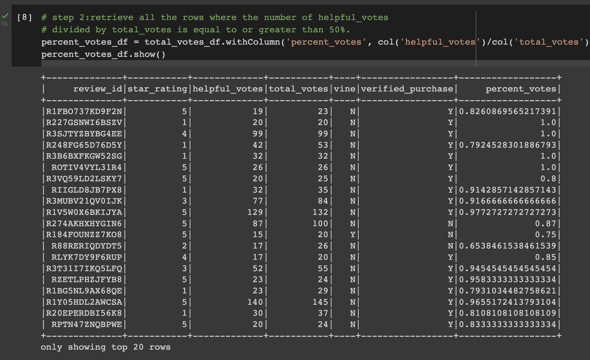
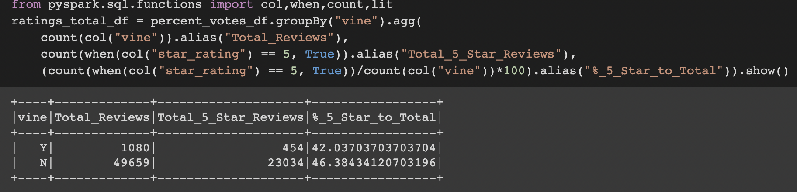

# amazon_vine_analysis

Big Data Analysis on an Amazon Vine Review Dataset using pgAdmin, PostgresSQL, Python, Pandas, Pyspark, AWS, Google Colab Notebook.

---

## Overview of the analysis: 

The purpose of this project is to analyze an Amazon Vine Review Dataset and find if there is a bias towards favorable reviews from Amazon Vine program members. Using PySpark in Google Colabs Notebook to perform ETL process, to connect to an AWS instance to load the transformed data into pgAdmin and Pandas to complete the analysis. The extract, transform and load into a dataframe was performed on the Electronics Review Dataset, link is below in the resources section. 

---

## Resources:

Data source: [Amazon Review datasets](https://s3.amazonaws.com/amazon-reviews-pds/tsv/index.txt), [Electronics Review Dataset](https://s3.amazonaws.com/amazon-reviews-pds/tsv/amazon_reviews_us_Electronics_v1_00.tsv.gz)

Tools: pgAdmin 4, PostgresSQL, Python, Pandas, PySpark, AWS, Google Colab Notebook

---

## Results: 

There were over three million reviews recorded in the dataset. The dataset was filtered down to count of total votes equal or greater than 20 and percent of helpful votes to total votes equal or greater than 50%. Reducing the  number of total reviews to just over 50K.

* How many Vine reviews and non-Vine reviews were there?
    * The Vine program members account for 1,080 or 2.1% of the reviews and non-Vine program members make up 49,659 or 97.9% of reviews. 

* How many Vine reviews were 5 stars? 
    * The Vine program members had 454 of the total five-star reviews out of 1,080.

* How many non-Vine reviews  were 5 stars?
    * The Non-Vine program members had 23,034 of the total five-star reviews out of 49,659.

* What percentage of Vine reviews were 5 stars? 
    * The Vine program members accounted for 42% of the reviews were rated five stars.

* What percentage of non-Vine reviews were 5 stars?
    * The Non-Vine program members were just over 46% of the rated five-star reviews.

---

## Summary: 

The analysis indicate that Vine program members did not show bias when rating products and might be more precarious in the review process. Since the number of five-star reviews for Vine program members (42%)  was almost 10% less  compared to non-Vine program members (a little over 46%). 

---
